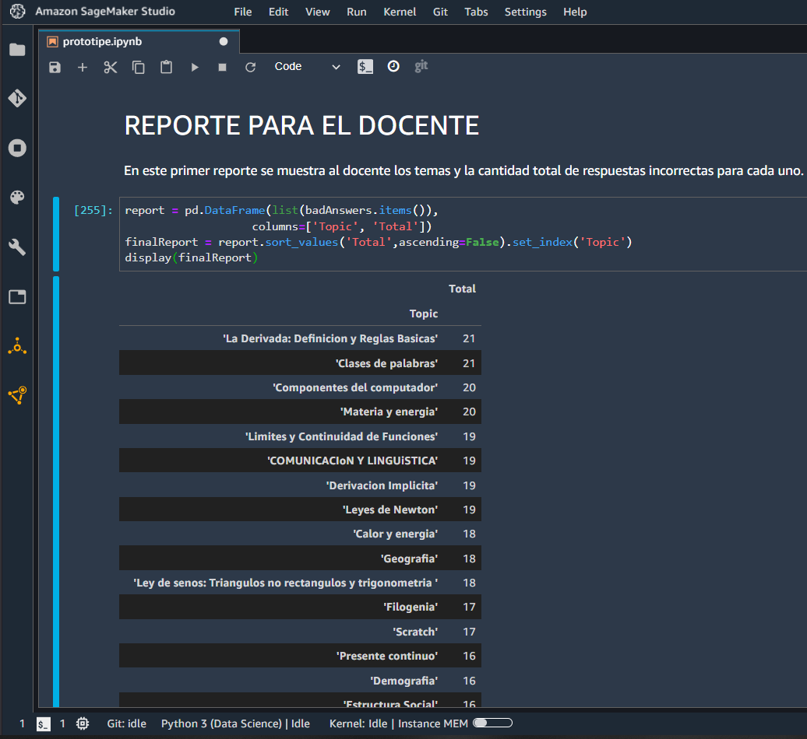

# ARQUITECTURAS EMPRESARIALES - PROYECTO FINAL

# Inteligencia artificial para la personalización de la educación básica secundaria en Colombia

### Introducción 

En el presente proyecto se realiza un prototipo de aplicación que permite la personalización de la educación con enfoque en la educación básica secundaria en Colombia.

### Prerrequisitos

* [JupyterLab](https://jupyter.org) - Entorno de desarrollo interactivo el desarrollo de Jupyter Notebooks. 
* [Python ](https://www.python.org) - Lenguaje de alto nivel de programación interpretado.
* [Git](https://git-scm.com/) - Sistema de control de versiones

### Instalación

Para descargar el proyecto ejecute 

   git clone https://github.com/ZulyVargas/AREP-PROY2022-1.git

## Construido con 

* [SageMaker](https://aws.amazon.com/es/sagemaker/) - Amazon SageMaker es una plataforma de aprendizaje automático.

* [Python](https://www.python.org) - Lenguaje de alto nivel de programación interpretado.

* [pandas](https://pandas.pydata.org) - Pandas es una librería de Python especializada en el manejo y análisis de estructuras de datos.

* [NetworkX](https://networkx.org) - NetworkX es un paquete de Python para la creación, manipulación y estudio de la estructura, dinámica y funciones de redes complejas.

* [Amazon S3](https://aws.amazon.com/es/s3/) - Servicio de almacenamiento de objetos que ofrece escalabilidad, disponibilidad de datos, seguridad y rendimiento.

### Desarrollo

Para el desarrollo del proyecto se tomó un conjunto de datos de prueba de 1000 registros de respuestas de estudiantes de las materias básicas vistas en secuendaria tal como Matemáticas, Español, Física, Inglés, Ciencias Sociales, Química, Biología, Infórmatica y Geometría. En estos registros se tiene el nombre del estudiante, el grado que cursa actualmente, la asignatura de la pregunta, la pregunta, la respuesta dada por el estudiante, la repsuesta correcta y el tiempo que le tomó responder a la pregunta. 
Este conjunto de datos se almacen+o en un bucket S3 provisto por AWS. Estos fueron cargados a Amazon SageMaker Studio en donde se realizó mediante jupyter nootebook el análisis de estos resultados. Finalmente se muestra el resultado obtenido por el estudiante y enlaces a vídeos con contenidos que pueden ayudarle a mejorar su progreso. Para el docente se muestran dos reportes: El primero de estos muestra al docente los temas y la cantidad total de respuestas incorrectas para cada uno. Se ordena de mayor a menor los resultados.El segundo reporte muestra cada estudiante y los temas en los cuales presentó dificultades.

### Datos cargados:

### Resultado por cada estudiante:

### Reporte #1:

### Reporte #2:

### Vídeo funcionamiento:

https://github.com/ZulyVargas/AREP-PROY2022-1/blob/main/prototipo2.mp4

## Autores

- **Camilo Andrés Pichimata Cárdenas**
- **Nicolás Medina Vargas**
- **Juan Carlos Alayón Molina**
- **Zuly Valentina Vargas Ramírez** 

## Licencia

Este proyecto esta bajo la licencia GNU(General Public License) los detalles se encuentran en el archivo [LICENSE](LICENSE.txt).
